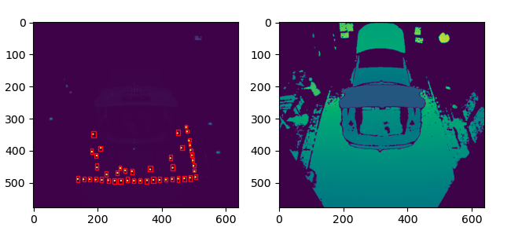

### Camera Calibration

---

#### Purpose of calibration

1. Validate the accuracy of camera in work distance of 3~4m
2. Get the direction vector of motion of vehicle
3. Get the transformation matrix from camera coordinate to world coordinate

----

#### Parameters of depth camera

> Device 0: 003008302912

resolution width: 640
resolution height: 576
principal point x(**ppx**): 315.598328 
principal point y(**ppy**): 331.969116
focal length x(**f_x**): 503.416229
focal length y(**f_y**): 503.437622
radial distortion coefficients:
k1: 3.647457
k2: 2.352810
k3: 0.120397
k4: 3.977356
k5: 3.541886
k6: 0.638353
center of distortion in Z=1 plane(**cod_x**), x: 0.000000
center of distortion in Z=1 plane(**cod_y**), y: 0.000000
tangential distortion coefficient x(**p1**): -0.000066
tangential distortion coefficient y(**p2**): 0.000057
metric radius: 0.000000

----

#### Brown-Conrady Calibration Model

- $\text{radial Distortion parameters: }k_1, k_2, k_3 \\ \text{Tangential distortion parameters: }p_1, p_2$

- $X = X_c / Z_c, Y = Y_c / Z_c$
- $r_2 = x^2 + y^2, r_4 = r_2 \times r_2, r_6=r_2 \times r_2 \times r_2 $
- $f = 1 + k_1r_2 + k_2r_4 + k_3r_6$
- $X = X \times f, Y = Y \times f$
- $dx = X + 2p_1XY + p_2(r_2 + 2X^2) \\ dy = Y + 2p_2XY + p_1(r_2 + 2Y^2) \\ X^{'} = dx \\ Y^{'} = dy$
- $u = X^{'}f_x + ppx \\ v = Y^{'}f_y + ppy$

---

#### Pipline of transformation from depth to point cloud

> Azure Kinect SDK, which using Brown Conrady model, and Rational 6KT is deprecated(only supported early internal devices), center of distortion is set to 0 for Brown Conrady model


**path** = ./transformation/main.cpp

**function**: point_cloud_color_to_depth -> k4a_trainformation_depth_image_to_point_cloud()

> Input: transformation_handel, depth_image,calibration_type,point_cloud

**path** = ./src/sdk/k4a.c

**Function**:  k4a_transformation_depth_image_to_point_cloud -> transformation_depth_image_to_point_cloud()

> Input: transformation_handle, depth_image_buffer, depth_image_descriptor, camera(calibration_type), xyz_image_buffer, xyz_image_descriptor)

**path** = ./src/transformation/transformation.c

Function: tranformation_depth_image_to_point_cloud()

Transformation_context = k4a_transformation_t_get_context(transformation_handle)


 -> transformation_depth_image_to_point_cloud_internal(xy_tables, depth_image_data, depth_image_descriptor, xyz_image_data, xyz_image_descriptor)

​	->transformation_depth_to_xyz(xy_tables, depth_image_data, xyz_image_data)

```python
x_table = xy_tables->x_table[i]
z = (int16_t)depth_image_data_uint16[i];
x = (int16_t)(floorf(x_tab * (float)z + 0.5f));
y = (int16_t)(floorf(xy_tables->y_table[i] * (float)z + 0.5f));
```


transformation_create(calibration )

​	-> Transformation_allocate_xy_tables()

 		-> transformation_init_xy_tables(calibration, camera, *buffer, xy_tables_data_size, xy_tables)

​			-> transformation_2d_to_3d(calibration, source_point2d[2], source_depth(1.f), source_camera, target_camera, target_point3d[3], valid)

​				-> transformation_unproject(calibration, point, depth,point3d,valid)

​					->transformation_unproject_internal(calibration,point2d,point3d,valid)


**Depth_xy_tables**


----


Camera Calibration(World Coordinate)

> spacing distance：15 cm





>  **x,y,z** aix are represent as red, green and blue

Validate Result of Calibration


Camera Calibration(Motion Vector)


Plane

```python
Plane(point=Point([ 559.1845914 ,  918.93269202, 3798.01612903]), normal=Vector([-0.00132521,  0.57736837,  0.8164827 ]))
```

Motion Line

```python
Line(point=Point([1473.59050651,  495.05763063, 4099.79166667]), direction=Vector([ 0.00657814, -0.81725962,  0.5762321 ]))
```

$V_z=[-0.00132521, 0.57736837, 0.8164827 ] \\
V_y=[0.00657814, -0.81725962,  0.5762321] \\
V_x=[-0.99997654, -0.00613457,  0.00271497]$


#### Tranformation Matrix R from Camera to World

$R=\begin{bmatrix}V_x\\V_y\\V_z\end{bmatrix}$ T=Plan.Point=$\begin{bmatrix} 559.1845 \\ 918.9326 \\ 3798.0161 \end{bmatrix}$

#### Resolution, Accuracy and Tolerance

$Resolution = \frac{Field\ OF\ View}{Pixel}$

$Accuracy = Resolution \times Effective\ Pixels$


