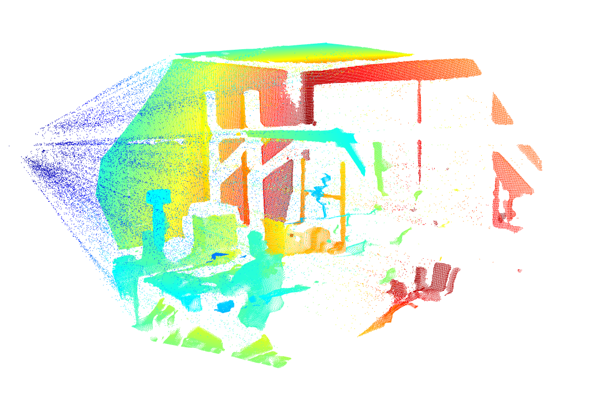
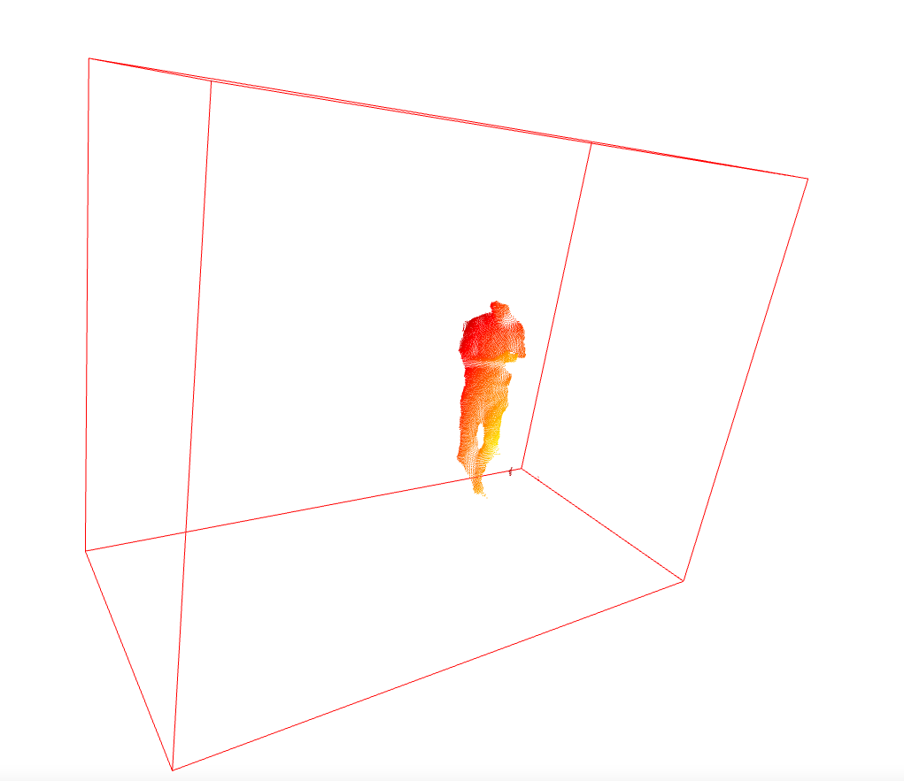
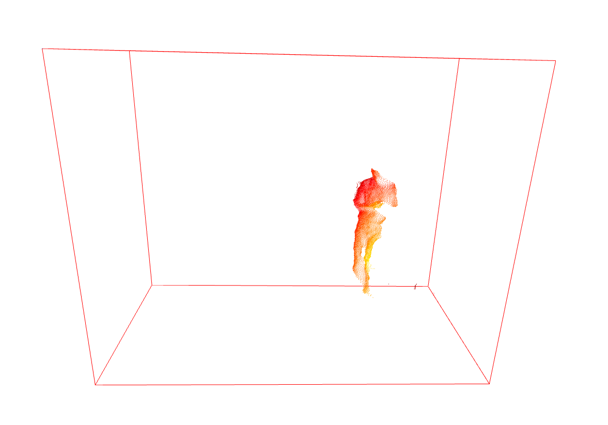

### Motion Detection

---

#### Results

- Picture 1 is frame to background subtractor

- Picture 2 is frame of motion object

- Picture 3 is motion object segmentation

#### MOG2 background subtractor

> 20 frames

Why there has noise points? Gaussian noise?

#### Tracking (DeepSort)

