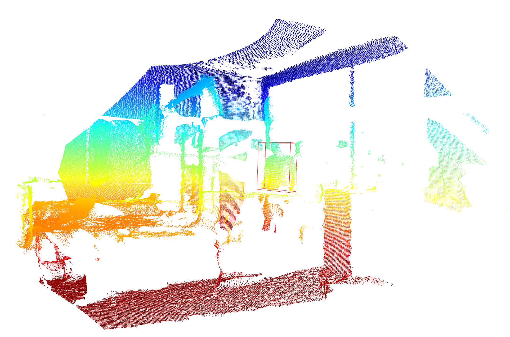
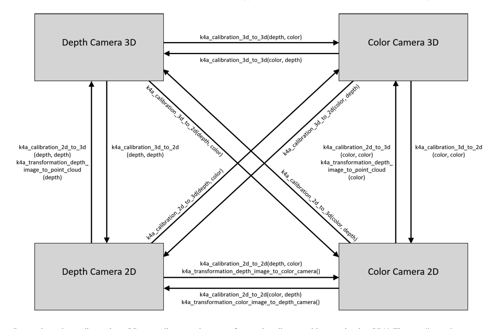

### Motion Detection

---

#### Method Proposed

---

- Picture 1 is frame to background subtractor
- Picture 2 is frame of motion object
- Picture 3 is motion object segmentation

#### MOG2 background subtractor

---

> 20 frames

Why there has noise points? Gaussian noise?

#### Camera coordinate & World geometry

---

#### Tracking (DeepSort)

---

#### RESULT & Problem

---

> Ver2.0

- IDX=70, Motion Area Threshold = 1000

- IDX=80, Motion Area Threshold = 1000

- IDX=90, Motion Area Threshold = 1000

- IDX=100, Motion Area Threshold = 1000

- IDX=110, Motion Area Threshold = 1000

- DX=120, Motion Area Threshold = 1000

- DX=130, Motion Area Threshold = 1000

- IDX=140, Motion Area Threshold = 1000

- IDX=150, Motion Area Threshold = 1000

- IDX=160, Motion Area Threshold = 1000

- IDX=190, Motion Area Threshold = 1000

- IDX=190, Motion Area Threshold = 1000

- IDX=250, Motion Area Threshold = 1000

- IDX=270, Motion Area Threshold = 1000

#### Next

- 毫米波雷达和图像融合

- 3D point unproject to RGB & tracking target initialization

​	

- 机器人、Camer、毫米波雷达信号的同步

机器人

