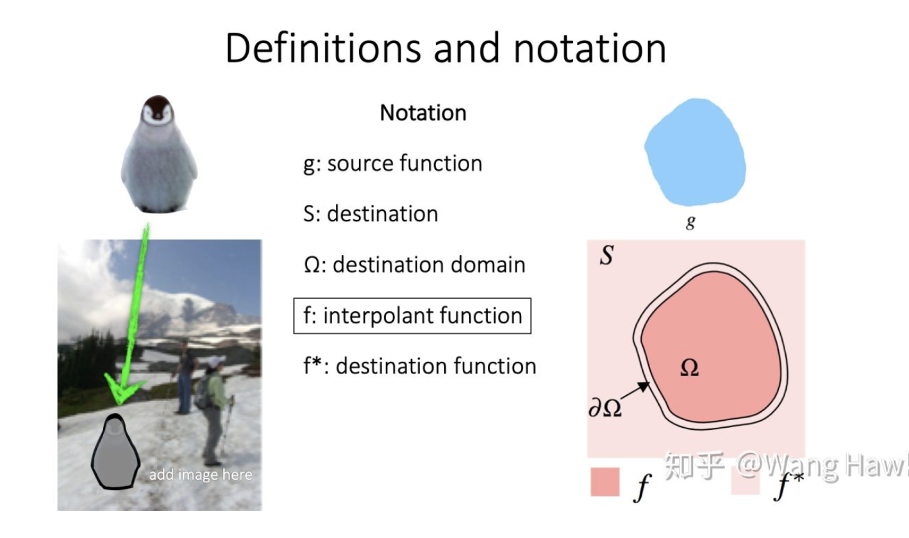
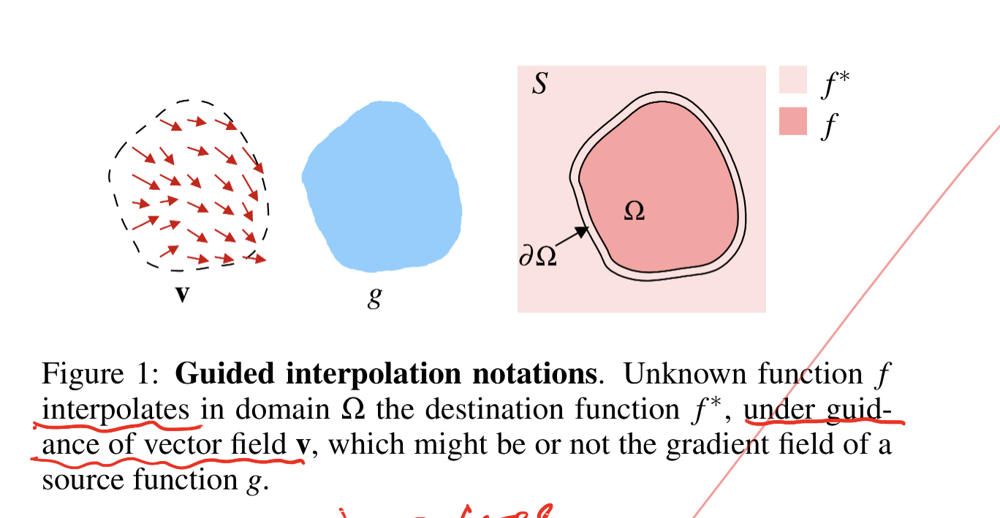

### Poisson equations

> image editing

Equilibrium 均衡

Why first talk about equilibrium?

Ohm's Law: $V_+ - V_- = I * R$

Voltage Change(volts) = Current(amps)*Resistance(ohms)

g, S, $\Omega$, $\partial\Omega$, $f^*$ 为已知量，$f$为待求解的函数

关键公式

$\triangle f = \triangle g \ over \ \Omega, with f|_{\partial\Omega}=f^*|_{\partial\Omega}$

这意味着对于f和g的每个像素的Laplacian算子的记过都一致

- Variational Problem 变分问题

==gradient of f **looks like** gradient of g==(source function)

> v在原论文中是指一个==**引导向量场（guidance field）**==，当用于图像合成时，它指的就是源图像的梯度。这意味着上面的变分方程是指在Ω 的区域内，f的梯度和源图像的梯度一致，而在Ω 的边缘处f的值则和源图像f*的值一致。这个变分方程的解是如下**泊松方程**在Dirichlet边界条件时的解，这也是为什么我们的融合方式叫做**泊松融合**。https://zhuanlan.zhihu.com/p/58867397

> The central insight in the paper is that working with image gradients instead of image intensities can produce much more realistic results. After seamless cloning, **the intensity of the result image in the masked region is NOT the same as the intensity of the source region in the mask resion. Instead, the gradient of the result image in the masked region is about the same as the gradient of the source region in the masked region.** Additionally, the intensity of the result image at the boundary of the masked region is the same as the intensity of the destination image. The authors show that this is done by solving a Poisson equation, and hence the title of the paper — Poisson Image Editing. https://www.learnopencv.com/seamless-cloning-using-opencv-python-cpp/

First, it is well known to psychologist that **slow gradient of intensity**(slow 很重要，slow gradient 代表梯度变化平稳), which are suppressed(抑制) by the Laplacian operator, can **be** **superimposed**（叠加） **on an image** with barely noticeable effect. **Conversely**, the **second-order variations**(二阶变分) extracted by the Laplacian operator are the most significant perceptually.

#### Key words

- Gradient $v=(u,v)=\triangledown g$ , gradient is a vector
- Laplacian $\triangle f = \frac{\partial^2f}{\partial x^2} + \frac{\partial^2}{\partial y^2}$, a scalar 
- Divergence $div\ v = \frac{\partial u}{\partial x} + \frac{\partial v}{\partial y}$, a scalar

- **Vector Field**，将空间每个点指派到一个向量的映射。设*X*是$R^n$里的一个连通开集，一个**向量场**就是一个向量函数$ \mathbf {F}:\mathcal(X)\rightarrow R^n$。如果F在*X*上是*k*次连续可微的，称F为一个$C^k$向量场。在X内，若$\mathbf{F}(x)=0$,则点x称为固定的。向量场可以理解为一个n位空间，其中对X内每一个点都有附着的n维向量

- Alpha图像融合

- ==Euler Equation==, 

  $ax^2y^{''} + bxy^{'} + cy=0$

  $F_f - \frac{\partial}{\partial x}F_{f_x}-\frac{\partial}{\partial y}F_{f_y}=0$

#### Poisson solution to guided interpolation

- **Guided Interpolation**

>  Image interpolation using a guidance **vector field**

- **Simplest interpolant**

> Laplace equation with Dirichlet boundary conditions

**Simplest interpolan**t $f$ of $f^*$ over $\Omega$   is the ==**membrane interpolant**== defined as the **solution of the minimization problem**:

$\underset{f}{min}\iint_{\Omega}\left \|\triangledown^2 f \right \|$ with $f|_{\partial\Omega}=f^*|_{\partial\Omega}$, where $\triangledown.=[\frac{\partial.}{\partial x},\frac{\partial.}{\partial y}]$ is the **gradient operator**.The minimizer must satisfy the associated **Euler-Lagrange equation**

$$\triangle f = 0$$ over $\Omega$ with $f|_{\partial\Omega}=f^*|_{\partial\Omega}$, where  $\triangle.=[\frac{\partial^2.}{\partial x^2},\frac{\partial^2.}{\partial y^2}]$ is the Laplacian operator. 

- Extended version of the 

$for\ all\ x\in\Omega, v(x) = \left\{\begin{matrix}
 \triangledown f^*(x),\ \ \ \ \ if \ \ |(1-mask(x))\triangledown f^*(x)|>|\triangledown g(x)| \\ 
 \triangledown g(x), \ \ \ \ \ \ \ \  otherwise 
\end{matrix}\right.$

 