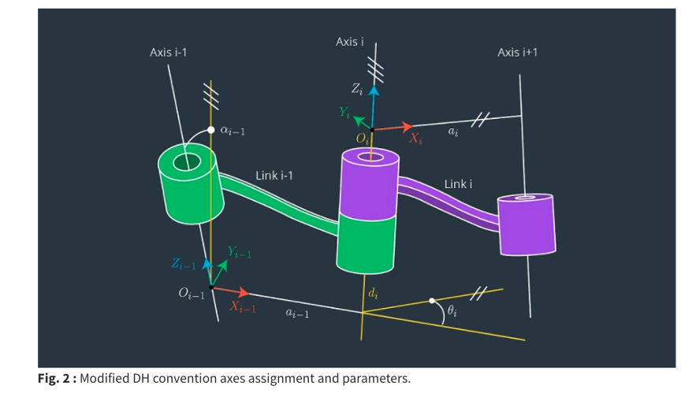

Kinematices Analysis and Simulation of KUKA Robot


###### KR 210 R2700 extra


#### D-H matrix in Robot 

>  Denavit-Hartenberg parameters


In 1955 Denvit and Hartenberg put forward (D-H) matrix method

Relation between the coordinate frames attached to the end-effector and the base.

position and orientation of the rigid body


$T_5^{0}$ Robot manipulator coordiante system relative to the postion and orientation of the fixed coordinate system

$A_1^0$ Body coordinate system relative to the base coordinate system

$A_2^1$ Souder coordinate system relative to the trunk coordinate system

$A_3^1$ Arm coordinate system relative to the shouder system


Frame of reference (参考系)

Kinematic chain (运动链)， is an assembly of rigid bodies connect by joints to provide constrains motion. 是构件之间连接（运动副）而构成的相对运动的系统

- 闭式运动链（闭链）
- 开链 ，多用在🦾

Kinematic pairs model the hinged and sliding joints fundamental to robotics

Cams and gearing, surface contact joints, called higher pairs

DOF(degrees of freedom) of a kinematic chain





```python
# KUKA KR9 R900 sixx
# DH parameters

s = {alpha0:      0,  a0:       0, d1:   0.400,
     alpha1:   pi/2,  a1:   0.025, d2:      0.,
     alpha2:     0.,  a2:   0.455, d3:      0.,
     alpha3:   pi/2,  a3:   0.035, d4:    0.42,
     alpha4:   -pi/2,  a4:      0., d5:      0.,
     alpha5:   pi/2,  a5:      0., d6:     0.08,
     alpha6:      0,  a6:      0., d7:       0.}
```


##### TEST

> KUKA KR210

{"A1":64.18, "A2":-102.88, "A3":120.61, "A4":-21.34, "A5":-39.33, "A6":124.21}


{"A1":67.73, "A2":-96.16, "A3":112.28, "A4":-15.79, "A5":-39.57, "A6":118.49}


