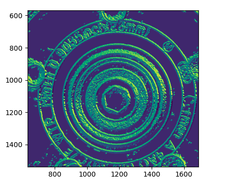
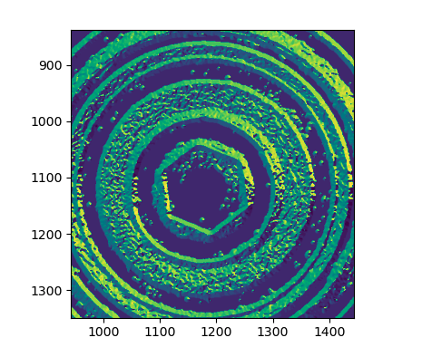
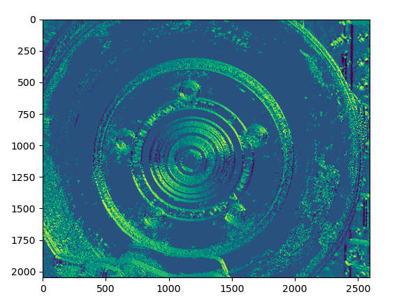
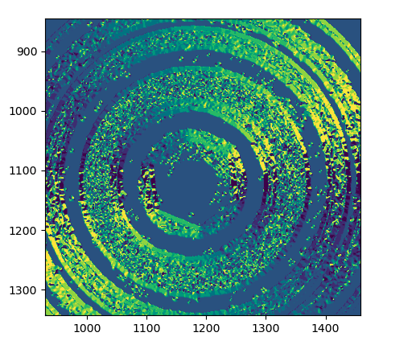
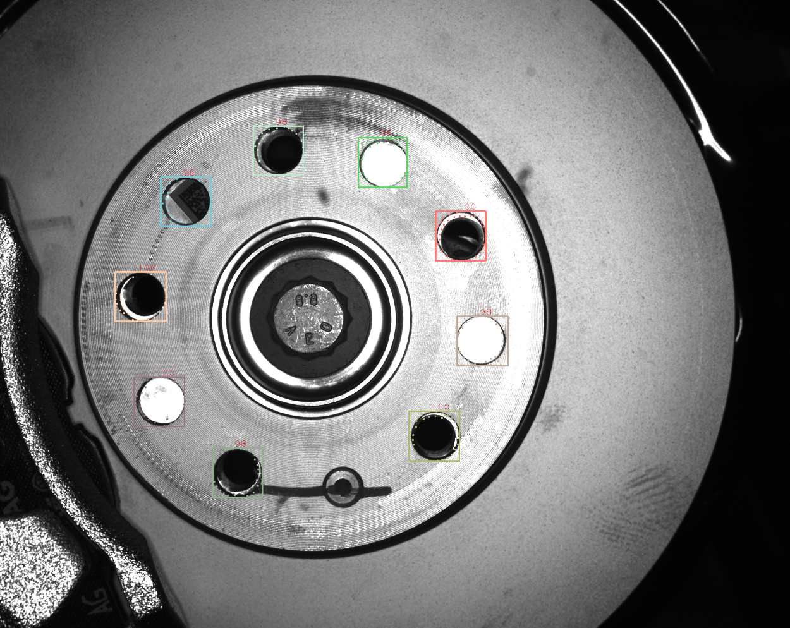
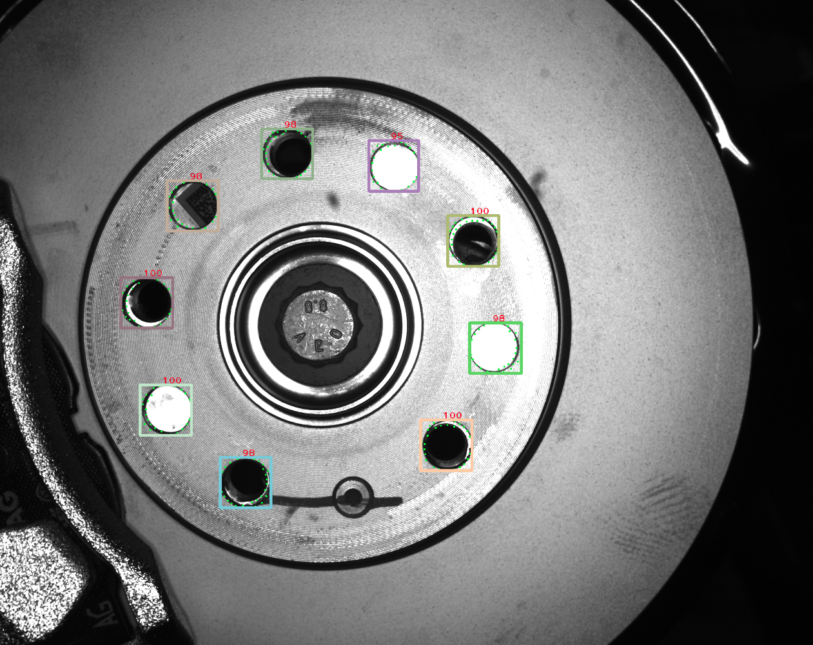

Template Matching


The different between statistical-learning techniques and template matching is that statistical-learning techniques aim at detection unseen objects from certain object classes instead of detecting a priori known object instances from mutiple viewpoints.

The templates is found in the image by computing the similarity between the template and the image for all relevant pose of the template.

the question is:

- The ways of similarity defined?

- How to compute the similarity?

  

The goal of template matching:

- robust recognition algorithm for finding a **particular** type of object.
- A method to find a any kind of object that can be configured simply by showing the system a prototype of the calss of objects.


#### Gradient Response Maps for Real-Time Detection of Texture-Less Objects


- a novel image representation for template matching designed to be robust to small image transformation
- Robustness is based on spread image gradient orientations 
- test only a small subset of all possible pixel locations when parsing the image
- propose a new image representation that holds local image statistics and is fast to compute
- using binary edge is very sensitive to illumination changes, noise and blur


##### Proposed approach

- Similarity Measure

$$


#### noise_test

---

##### Initialization

```c++
line3Dup::Detector detector(30,{4,8})
```

- **Detector initialize**
  - int num_features = 30

  - vector T = {4, 8}

  - float weak_thresh = 30.0f

  - strong_thresh = 60.0f

    

> ```c++
> this->modality = makePtr<ColorGradient>(weak_thresh, num_features, strong_threash);
> pyramid_levels = T.size();
> T_at_level = T;
> ```
>
>  Make ColorGradient ptr modality,  and initialize with weak_threash, num_features and strong_threash


- **Shape info**

```c++
shape_based_matching::shapeInfo_producer shape(img, mask)
```

- **Add template**

```C++
int templ_id = detector.addTemplate(shapes.src_of(info), class_id, shapes.mask_of(info));
```

​	-  Template Generation

​		- modality->process(src, obj_mask)

```c++

```


```c++
cv::Ptr<ColorGradientPyramid> process(src, mask)
```

Class ColorGradientPytramid

- Src, mask, weak_threshold, num_features, strong_threshold
- Quantize 
- extracttemplate
- pyrDown
- update
- Candidate

##### quantize 360 degree range of orientations into 16 buckets






###### Mask 16 buckets into 8 quantized orientations











