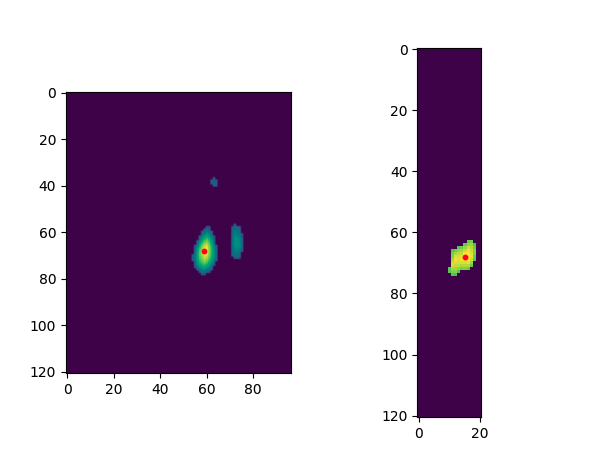
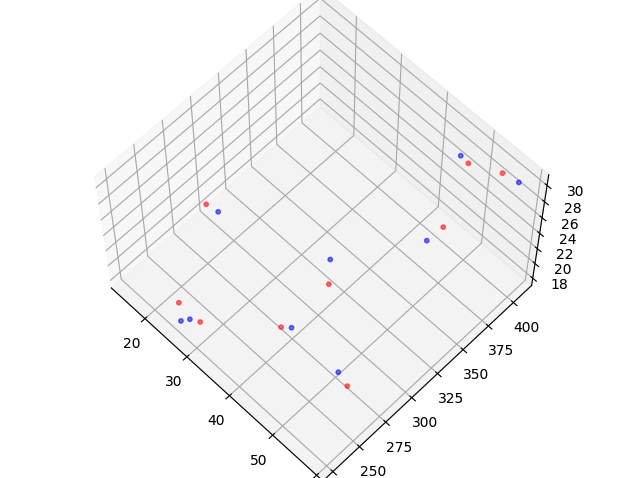
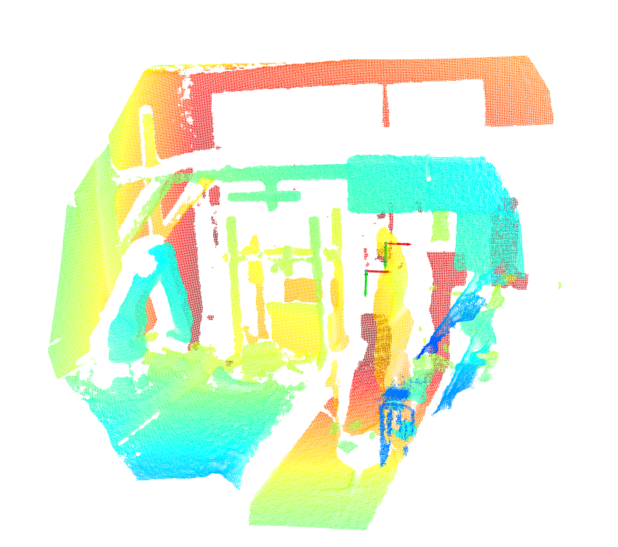
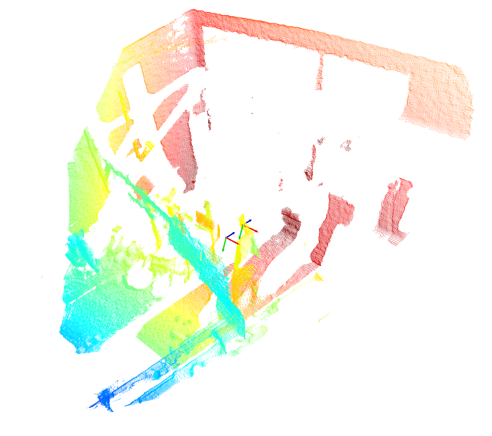

#### Wave calibration

##### CONFIGURATION:

- Cfg.MonitoredRoomDims [-3.0, 3.0, 0.2, 5.0, 0.0, 2.0]
- Cfg.Arena(2).xi_res 0.05
- Cfg.Arena(2).yi_res 0.05
- Cfg.Arena(2).zi_res 0.1

tranformation matrix 的求解为非线性方程组，需要找相机标定源代码来获得求解方法

$\left[\begin{matrix}- \sin{\left(\alpha \right)} \sin{\left(\gamma \right)} \cos{\left(\beta \right)} + \cos{\left(\alpha \right)} \cos{\left(\gamma \right)} & - \sin{\left(\alpha \right)} \cos{\left(\beta \right)} \cos{\left(\gamma \right)} - \sin{\left(\gamma \right)} \cos{\left(\alpha \right)} & \sin{\left(\alpha \right)} \sin{\left(\beta \right)} & t_{x} \left(- \sin{\left(\alpha \right)} \sin{\left(\gamma \right)} \cos{\left(\beta \right)} + \cos{\left(\alpha \right)} \cos{\left(\gamma \right)}\right) + t_{y} \left(- \sin{\left(\alpha \right)} \cos{\left(\beta \right)} \cos{\left(\gamma \right)} - \sin{\left(\gamma \right)} \cos{\left(\alpha \right)}\right) + t_{z} \sin{\left(\alpha \right)} \sin{\left(\beta \right)}\\\sin{\left(\alpha \right)} \cos{\left(\gamma \right)} + \sin{\left(\gamma \right)} \cos{\left(\alpha \right)} \cos{\left(\beta \right)} & - \sin{\left(\alpha \right)} \sin{\left(\gamma \right)} + \cos{\left(\alpha \right)} \cos{\left(\beta \right)} \cos{\left(\gamma \right)} & - \sin{\left(\beta \right)} \cos{\left(\alpha \right)} & t_{x} \left(\sin{\left(\alpha \right)} \cos{\left(\gamma \right)} + \sin{\left(\gamma \right)} \cos{\left(\alpha \right)} \cos{\left(\beta \right)}\right) + t_{y} \left(- \sin{\left(\alpha \right)} \sin{\left(\gamma \right)} + \cos{\left(\alpha \right)} \cos{\left(\beta \right)} \cos{\left(\gamma \right)}\right) - t_{z} \sin{\left(\beta \right)} \cos{\left(\alpha \right)}\\\sin{\left(\beta \right)} \sin{\left(\gamma \right)} & \sin{\left(\beta \right)} \cos{\left(\gamma \right)} & \cos{\left(\beta \right)} & t_{x} \sin{\left(\beta \right)} \sin{\left(\gamma \right)} + t_{y} \sin{\left(\beta \right)} \cos{\left(\gamma \right)} + t_{z} \cos{\left(\beta \right)}\\0 & 0 & 0 & 1\end{matrix}\right]$

#### scipy

- scipy.optimize.fsolve

- scipy.optimize.root

Sci

#### sympy

- Solve 

- xi_res 0.05m
- yi_res 0.05m
- zi_res 0.1m

- Mod: 7-MTI

