## 感知规划

### 初步计划

第一阶段作业提示

抛出问题，个人思考，信息搜集：12月31日-4日

说明：   1. 没有对错：大家不用担心说错，因为我也不知道，所以邀请大家一起来做！

   				2. 视角和出发点要拔高：首先是从研究所的层面和维度，不要只局限在自己的工作中。
   				3. 目标要有一定的野心：提的目标不能太底，搞定了也是没有价值或没有高度的不行？
   				4. 也不能脱离实际：比如我们跟达摩院一样投入几百人人来干这个事
   				5. 特别需要从行业或产业、技术两个高度去思考

### 第一阶段作业

研究领域

- 嵌入式系统设计、微弱信号检测、复杂环境下信号检测等**传感感知技术**，实现高精度、低噪音、实时、可靠的数据采集；
- 物联网、数据库、网络和信息安全等**平台支撑技术**，实现安全、可靠的企业级数据通讯与储存；
- 机器学习、深度学习、数据挖掘、机器视觉等**智能感知技术**，实现准确率高、通用性好的智能识别、决策系统。

#### 定位和目标（通过以下问题，来提炼我们的定位和目标）

Q1 : 从内部（CRC或集团）来看，3年或5年后我们是什么样的？能服务什么产业（集团现有业务范围内）？能做多大的贡献？

涵盖传感器感知技术、网络数据平台支撑技术、智能感知技术三大研究领域，为智能终端、工业机器人、工业物联网核心系统和重要部组件提供关键感知装备与解决方案。

Q2：从外部看（行业、竞品、学术界），我们是什么样的？

定位基础科学和创新技术研究

Q3：内部有没有一个哪个团队是我们想成为的样子？(级别和体量大体相当)

Q4：外部有没有一个哪个团队是我们想成为的样子？(级别和体量大体相当)

Google X team

Q5：从技术方向，未来我们最强的应该是哪些项？(不能笼统的讲 定位技术或避障技术、规划技术，最好有子技术领域，或有应用范围的词描述)

通用场景三维物体识别分割及位姿识别，基于多传感器融合的机器人环境感知

Q6：明确了目标，那分3年，每年大概到什么程度?短语或10字描述

1. 
2. 
3. 

#### 要达成目标，按年度分解，实现路径是什么

###### Q1 面向我们要做的事，外部现状是什么？

- 最强或技术最好的公司是？他们当前的状态是？产品或应用情况是？

- 

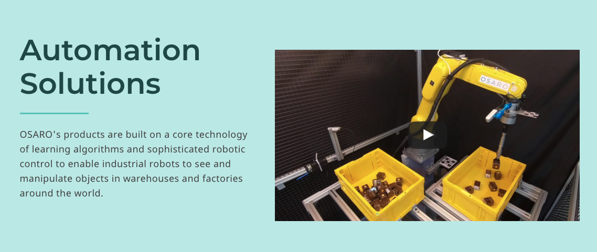

FreeMove makes industrial robots collaborate

# Transforming factories with responsive machines

Using advanced computer vision and 3D sensing, Veo Robotics makes standard industrial robots responsive to humans so they can work safely side-by-side.

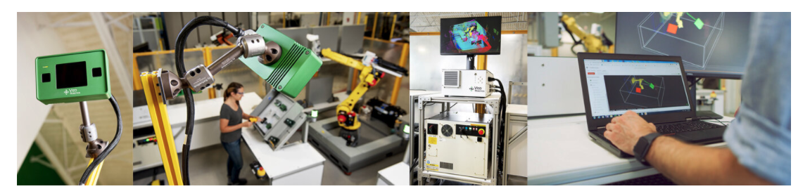

FreeMove Sensors®

FreeMove Engine® 

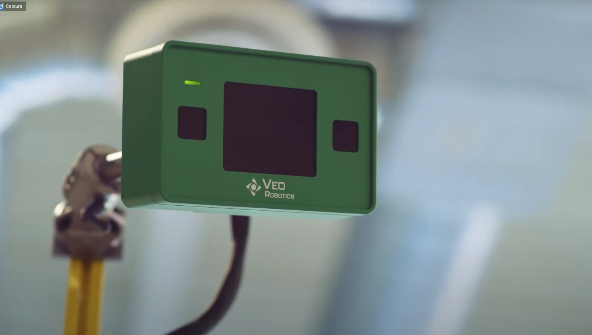

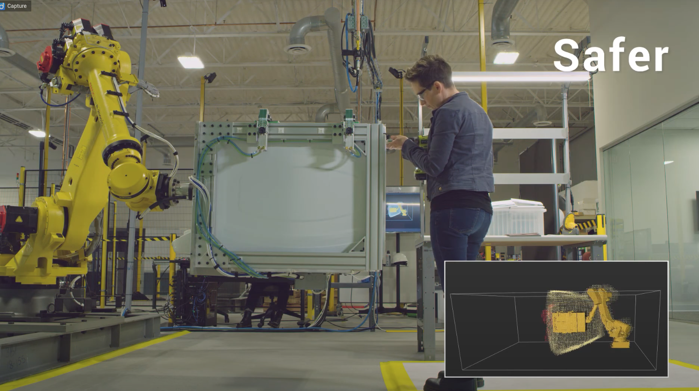

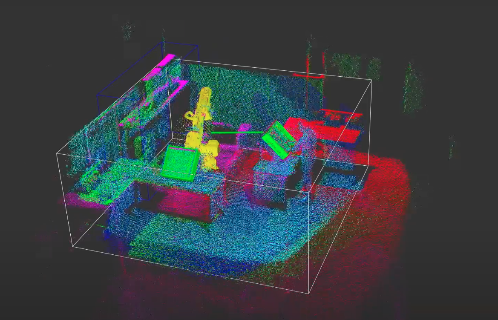

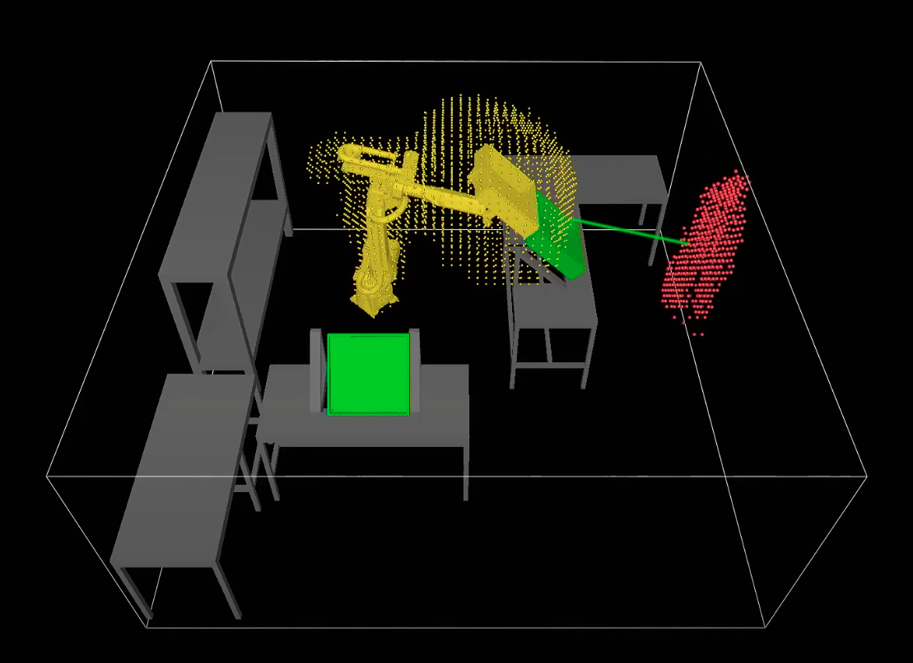

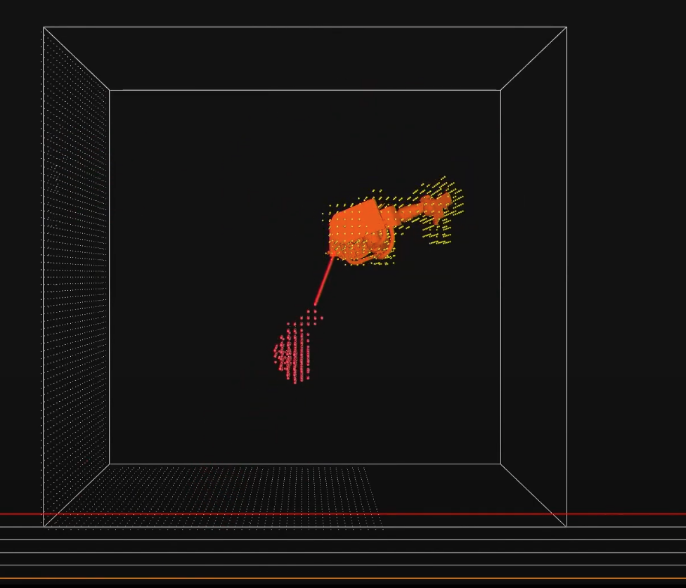

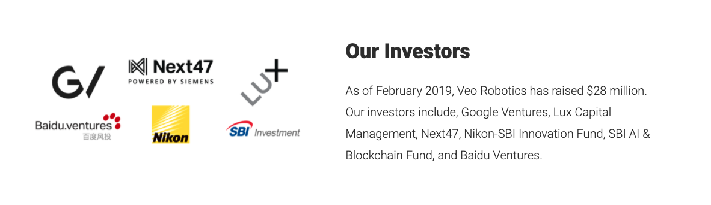

·

- 学术界，最强的院校或科研单位是？

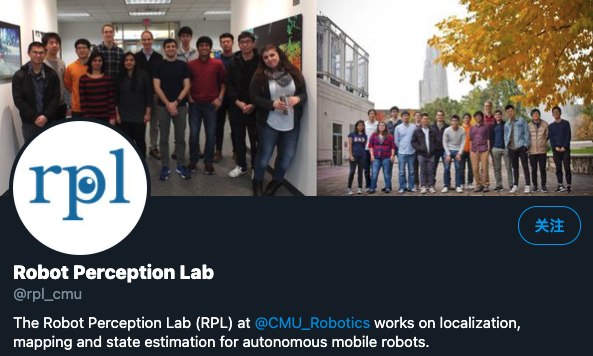

#### Georgia Institute of Technology

Georgia Tech, School of Interactive Computing,Robotics & Computational Perception

> 佐治亚理工学院

Robotics and computational perception research at Georgia Tech runs from engineering to machine learning, from locomotion to autonomous ethical behavior in robotic machines. Our work is focused in two of our research centers and labs: The Robotics and Intelligent Machines (RIM) Center at Georgia Tech and the Computational Perception Lab (CPL).

RIM leverages the Institute’s strengths and resources by reaching across traditional boundaries to embrace a multidisciplinary approach. The College of Computing, College of Engineering and the Georgia Tech Research Institute play key, complementary roles through Tech's traditional expertise in interactive and intelligent computing, control and mechanical engineering. Emphasizing personal and everyday robotics, as well as the future of automation, RIM faculty help students understand and define the future role of robotics in society.

CPL was developed to explore and develop the next generation of intelligent machines, interfaces and environments for modeling, perceiving, recognizing, and interacting with humans. CPL domains of interest include computer vision/perception, computer graphics, computer animation, human-computer interaction, digital special effects, artificial intelligence, pattern recognition, machine learning, robotics, aware home/environments, audio processing, ubiquitous computing/sensing, eldercare technologies, motion analysis, and computational music.

MIT

Perceptual Science Group @ MIT

http://persci.mit.edu/

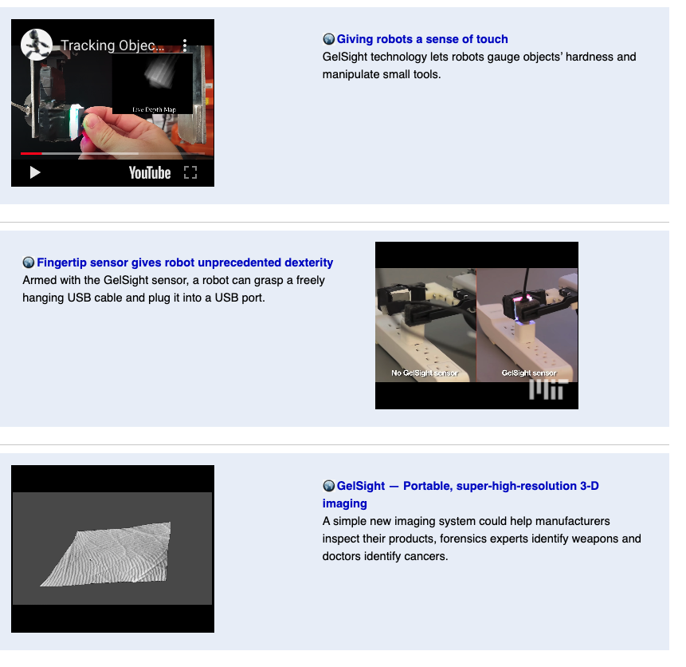

SPARKlab

http://web.mit.edu/sparklab/archive.html

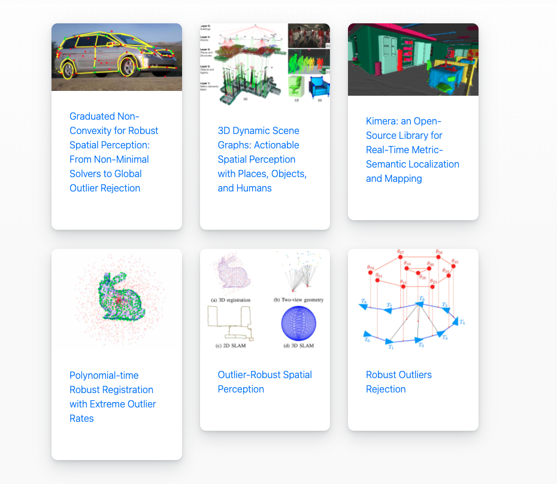

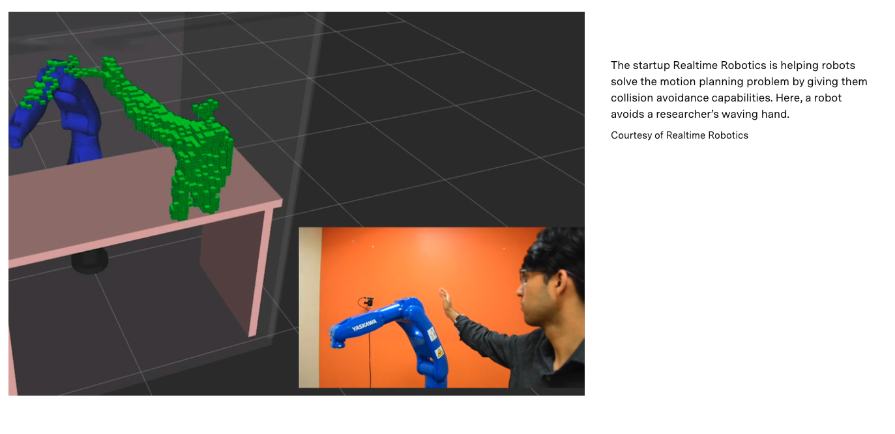

- 学术界，最牛的老师或教授是？

Ken Goldberg

Professor, Industrial Engineering and Operations Research,UC Berkeley

###### Q2 面向我们要做的事，内部现状是什么？

- 内部客户是谁？哪个产业，规模，市场地位，技术现状？

  - 内部客户：KUKA中国
  - 产业：工业机器人
  - 规模：??
  - 市场地位：??
  - 技术现状：各大机器人厂商的机器人都配备有各自的安全技术，但其安全功能本身还比较初级，例如将物理的围栏换成了虚拟围栏、检测到有人靠近时自动停止，仍然不算是完整的协作安全技术。
- 内部客户提了哪些需求？
  - 传统工业机器人相比是否可不依赖笼子进行简单隔离这一安全措施，通过应用主动的安全探测手段代替被动传感器，实现与人类的安全互动。
- 我们最大的竞争对手？
  - 
- 内部其他相关的研发力量及进展和状态？

###### Q3 技术方向1: 	

- 第一曲线是什么？技术成熟度模型是怎么样的？我们规划怎么提示？

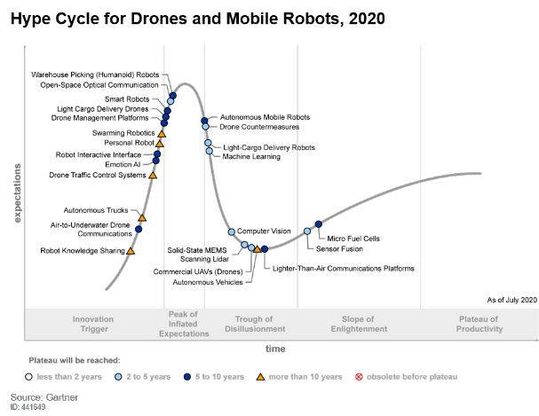

- 第二曲线有吗？什么时候启动？

###### Q4 技术方向2: 	

- 第一曲线是什么？怎么规划？ 
- 第二曲线有吗？什么时候启动？

#### 项目和重点工作（2021年）

Q1 方向1: 	明年的项目是什么？目标和计划是什么？

Q2 方向2: 	明年的项目是什么？目标和计划是什么？

Q3 方向1: 	明年的项目外的重担工作是什么？目标和计划是什么？

#### 团队建设

Q1 未来三年，我们的团队规模怎么增长？多少人？放哪里？

Q2 明年，子模块需要多少人，什么样的人？方向、能力等级？

#### 保障

Q1 硬的：需要什么硬件设备或实验室投资？

Q2 软的：工具和平台？

Q3 编制外的人：外包、实验员、实习生导航？

Q4 需要哪些研究院内部部门的支持，哪些方面的支持？