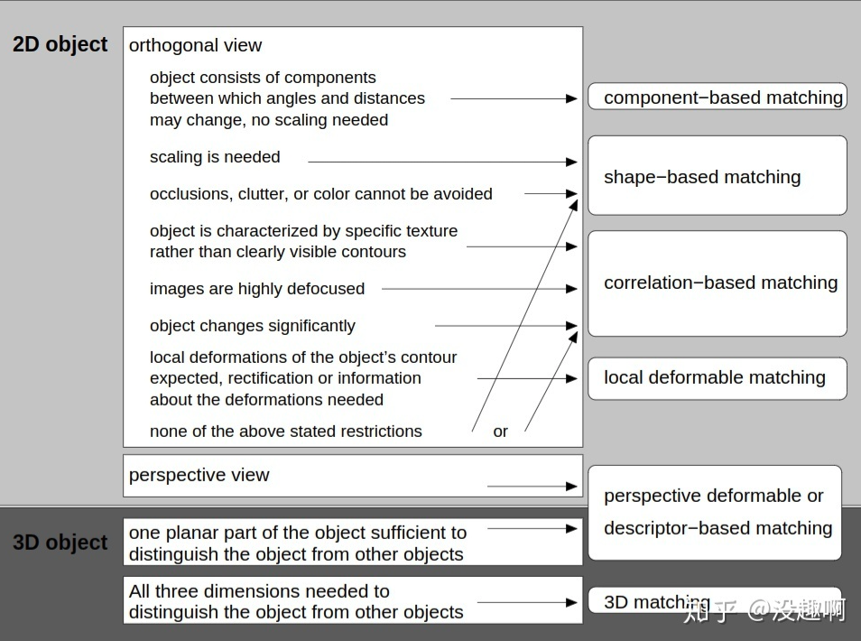

### 机器视觉 Machine Vision

---

机器视觉的目的是给机器人提供操作物体的信息，物体抓取领域主要研究内容

- Object Recognition
- Pose Estimation
- Camera Calibration

#### Pipline

Calibration -> Pose Estimation -> Motion Plan

https://www.zhihu.com/question/26199861/answer/154228960

#### Calibration

> 求解机器人坐标系和视觉系统坐标系的转换矩阵

https://mp.weixin.qq.com/s?__biz=MzA5MDE2MjQ0OQ==&mid=2652786821&idx=1&sn=297af3939075dbc926e6d785911104e9&chksm=8be524fbbc92aded68bacb1766df0a17127a96f22e1e39199f554b51511a1a9dae4a639810ef#rd

##### eye to hand

> 摄像头安装在手臂之外的部分，与机器人的基座（世界坐标系）相对固定，不随着机械臂的运动而运动；

#### Object recognition

##### 平面物体检测

> 主要计算物体$(x, y, \theta)^{T}$ 三自由度

主要方法为边缘提取+边缘匹配/形状匹配， 为了提高稳定性，一般通过打光源、采用反差大的背景等手段，减少系统变量。

##### 有纹理

环境复杂性：

- 光照条件不确定性
- 物体与相机之间距离不确定性（尺度）
- 成像角度的不确定性（旋转，仿摄）
- 遮挡

经典方法

- SIFT（scale-invariant feature transform）
- SURF
- ORB

##### 无纹理

Template Matching

###### 商用软件

- **Halcon**
  - 在商业的视觉软件中，halcon的shape-based match和cognex的patmax算法可以满足你的需要，他们都是轮廓匹配算法，可以抗旋转、缩放和部分遮挡而且精度是亚像素。
  - halcon的轮廓匹配算法是通过边缘的梯度方向和梯度值计算匹配度，根据设定的旋转步长和缩放系数预先建立各个角度和缩放比例下的模板，是一种穷举方法，因此如果写的不好算法是十分耗时的。

- **VisionPro**
- **PatMax**
- **OpenVision**

###### Methods

- LineMod

  >Hinterstoisser S, Holzer S, Cagniart C, et al. Multimodaltemplates for real-time detection of texture-less objects in heavily clutteredscenes[C]// International Conference on Computer Vision. IEEE Computer Society,2011:858-865.

  - Lined 与shape based matching 同宗同源, https://zhuanlan.zhihu.com/p/45538349
  - shape-based matching只用**梯度方向**，也就是说不管你用什么花样的算法，**当你开始提边缘时你就输了**。这是因为边缘和梯度方向虽然都不易被干扰，但一个边缘只有有无边缘**1bit**的信息量，一旦提多了很难找出想要的形状。
  - linemod正是这样，简单来说就是选几十个点的梯度方向拿去在图像中进行方向的模板匹配，经过一系列奇巧淫技加速，最终100万像素处理图像耗时60ms，**匹配360个模版才7ms**

##### 深度学习

CNN detection&segmentation

#### Pose Estimation

> 物体完整位姿$(x,y,z,rx,ry,rz)^{T}$

CNN

- Two Stage
  - detetion & segmentation
  - ICP

- END-to-END
  - 2D pose estimation
  - 3D pose estimation

