### 项目需求书

---

#### 1. 编写目的

编写此文档，旨在说明本项目所拥有的功能及功能规定，对功能需求、性能需求和其它非功能性需求进行了详细的描述，并整理出应用的整体结构，从多方面说明系统轮廓，以此保证项目开发的需求、质量的完整性和可塑性，保证相关人员对需求达成共识。

本文档可作为：
1.开发人员对系统功能开发的依据。
2.设计人员进行系统设计的输入源。
3.测试人员编写系统测试计划、测试案例的编写的输入源。
4.项目团队外人员进行沟通的外部接口，用于他们的理解和评审系统。
5.项目需求阶段的主要交付物。

#### 2. 项目背景

全自动轮胎装配方案代替现有半自动化装配方案，以此缩减人力成本。视觉定位系统为机器人轮胎抓取及装配过程提供：

- Wheel position including orientation（x,y,z,$\alpha$）
- Brake disc position and orientation (x,y,z,$\alpha$,$\beta$,$\gamma$)
- Alignment offset($\triangle x, \triangle y, \triangle z , \triangle a, \triangle b, \triangle c$)

##### 2.1 项目甲方及主要诉求

- 甲方：KUKA中国
- 主要诉求：
  - **低成本（主要诉求）**
  - 目前采用ISV推荐2D方案，痛点问题为二次拍照所带来不稳定因素
  - 延伸诉求为技术可控，以便后期推广、服务及维护

##### 2.2 潜在客户及主要诉求

- 上汽大众
- 产线改造以减少对人力资源的依赖

##### 2.3 目前项目状态

- KUKA作为先行项目立项，并在上汽大众进行Field Test
- 潜在客户为上汽大众，但无签单时间，未来市场推广计划未知
- 对于上汽大众，今年产线升级规划及预算已包含轮胎自动装配，关键问题是方案商所提报价是否符合预期

##### 2.4 竞争对手

- ISRA VISION

  - 方案

  

  

  - 指标

    

    

    

  - 成本未知

- ISV
  - 方案

  

- 指标		
  - 工作距离： 350mm
  - 系统精度：$\pm 0.5$ mm
  - 视觉节拍：< 2s 次
  - 定位成功率：95% (失效情形下，系统日志及图像数据有机会获取）
- 成本 (KUKA 采购成本)

#### 3. 功能要求

- Wheel position including orientation（x,y,z,$\alpha$）

- Brake disc position and orientation (x,y,z,$\alpha$,$\beta$,$\gamma$)

- Alignment offset ($\triangle x, \triangle y, \triangle z , \triangle a, \triangle b, \triangle c$)
- 可对不同轮胎型号、刹车盘型号进行适配

#### 4. 非功能要求

- 性能要求
  - 工作距离： 500mm
  - 系统精度：$\pm 0.3 mm$
  - 节拍：< 2s 

- 系统要求
  - 相机固定安装或固定在机械臂
  - 随动装配
  - 大板速度：约为0.1m/s
  - 机器人随动过程重复定位精度：1mm
  - 视觉定位至预紧时间间隔：1-2s
  - 一次定位+随动精度可保证拧紧指标要求，无需二次或实时定位
  - 编码器响应精度：**待确定**
  - 夹取过程轮胎位姿的不变性由夹具结构设计保证
  - 轮胎与刹车盘定位孔无需一一对应，包括具有防盗螺栓车型
  - 低学习成本配置及交互界面

#### 5. 镜头及相机选型

##### PCD孔距

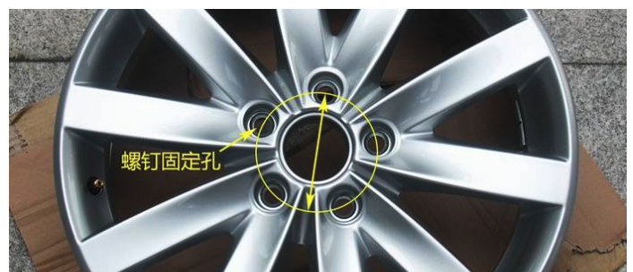

- **汽车厂商车轮孔距**
  - A0级的飞度，雨燕，雅力士，嘉年华等孔距为4x100孔距，
  - POLO,BRZ,GT86等车型用的5x100孔距，
  - 特别点的老骐达等的大四孔 4x114.3孔距。
  - 日系A级车或以上例如思域、杰德用的是5x114.3孔距，
  - 德系三巨头ABB一般是5x112，
  - 福特A级车以上的5x108，
  - 比较特殊的是有标致雪铁龙的4x108，保时捷的5x130，阿尔法罗密欧的5x98等等等等。

##### 刹车盘尺寸

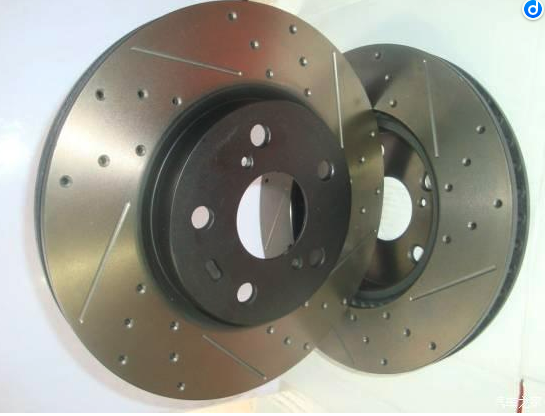

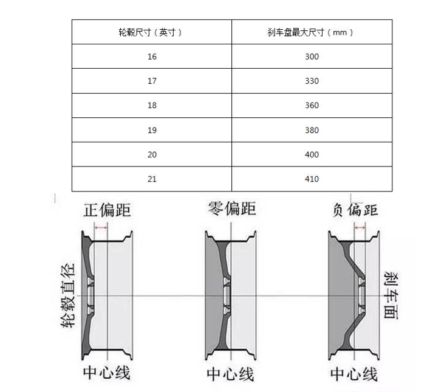

##### 方案一

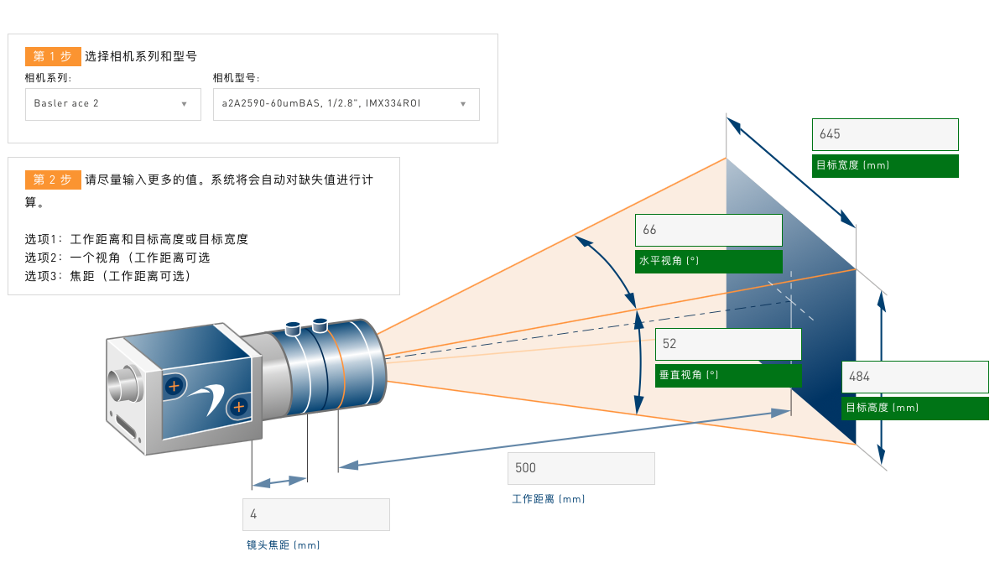

- Basler Lens C125-0418-5M-P f4mm

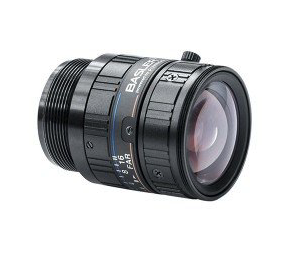

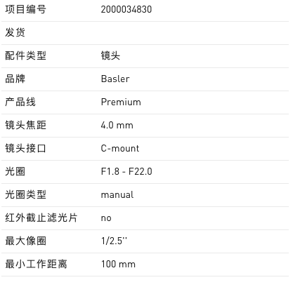

- 镜头：a2A2590-60umBAS

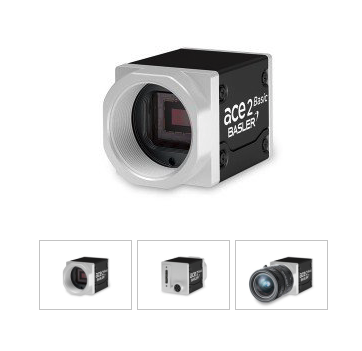

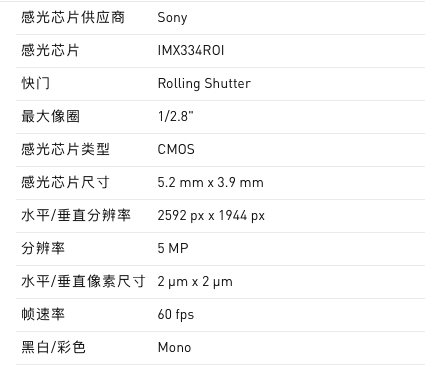

- 最短和最长曝光时间

- 理论分辨率：645/2592=0.249mm/pixel

##### 方案二

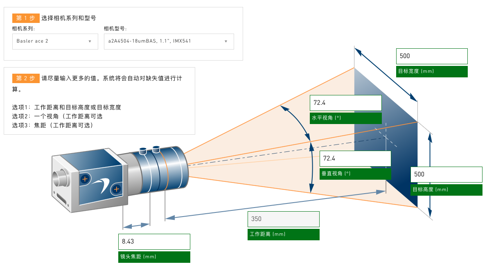

- Basler a2A4504-18umBAS

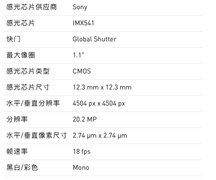

- 最短及最长曝光时间

- 镜头：Basler Lens C11-0824-12M-P f8mm

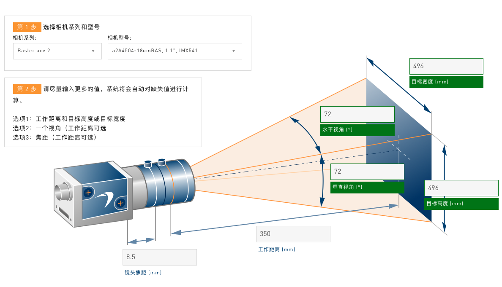

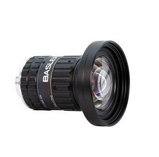

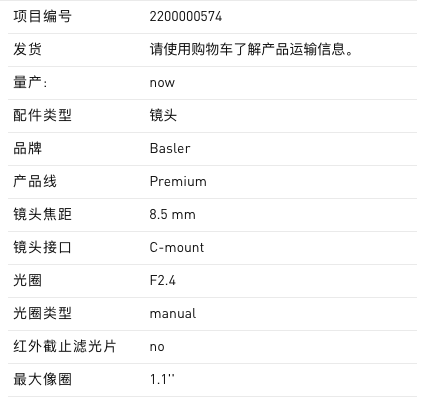

- 理论分辨率：0.1101mm/pixel

- Fujinon Lens CF8ZA-1S F1.8 f8mm 1.2"

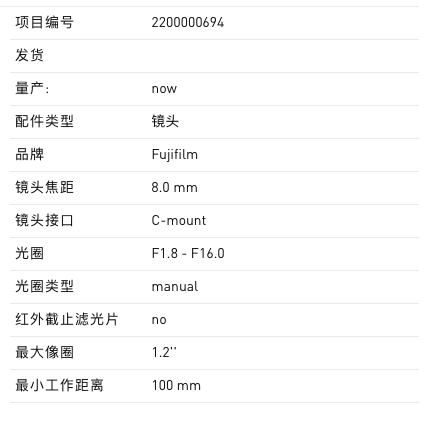

- 理论物理分辨率：0.117mm/pixel

#### 6. 项目规划

待完成

技术问题

1. 技术的可复制场景
2. 技术难度

