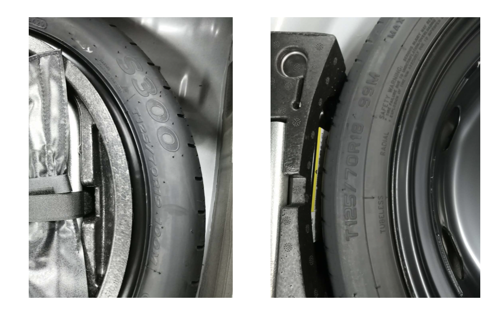
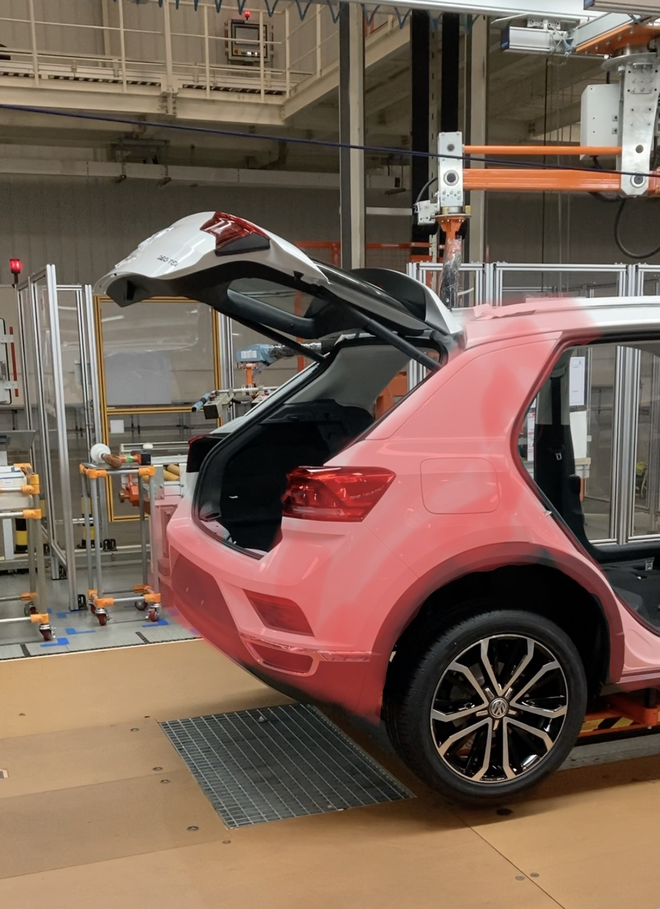
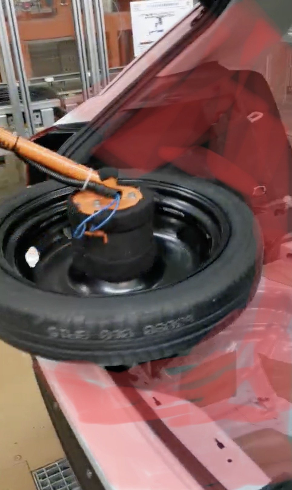

### 进厂车体扫描需求

##### 1.  扫描目标

- 现支持自动装配所有车型，T-ROC，GOLF，Audi Q2L
- 现支持自动装配所有型号备胎，T125/70R19，T25/70R8

> 车身颜色不做特殊要求，每种车型根据现场条件选择车身颜色，但要保证扫描数据质量

#### 2. 扫描范围

- 车体，碰撞高风险区域，双侧，后备箱开启状态

- 车体，碰撞低风险区域，备胎放置前，备箱区域

- 轮胎，完整扫描，供后期建模

#### 3. 扫描分辨率及精度

- 扫描设备实际分辨率及精度情况调整高、中、或低，其均符合我们对精度的要求。如单次扫描无法覆盖需扫描范围，可分区域扫描，但区域间必须有重叠，并有显著特征，可做后期匹配及拼接